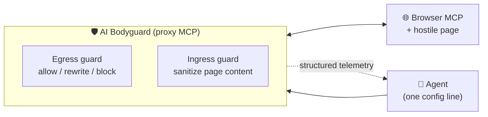

<div align="center">

# 🛡️ AI Bodyguard

**A real-time shield that protects autonomous web agents from deceptive interfaces.**


[Problem](#-the-problem) ·
[What we build](#-what-we-are-building) ·
[Design](#-rough-design) ·
[Repo map](#-repository) ·
[Team](#-team)

</div>

> 📖 **Full working context lives in [`context.md`](context.md).**
> This README is a thin dispatcher: read it in two minutes, then jump.

---

## 🎯 The problem

> **TRACK 03: AI Bodyguard, Autonomous Agent Shield**

### 🧠 The situation

Human users rely on spatial awareness and intuition to avoid sketchy pop-ups, fake
download buttons, bait-and-switch checkboxes, and hidden subscription traps.

Autonomous web-browsing agents (for example Playwright/Puppeteer-driven LLMs) read the
web mechanically, relying on raw DOM trees, accessibility trees, or screen coordinates.
Malicious sites exploit this blind spot using agent-targeted dark patterns and UI traps
to hijack automated workflows.

### 🚀 The mission

Build a real-time defensive middleware, an **"AI Bodyguard"**, that intercepts,
evaluates, and protects autonomous web agents from deceptive interfaces and adversarial
web design.

### 📋 Technical scope

| | Area | Requirement |
|:-:|------|-------------|
| 🔌 | **Interception layer** | Sits between the web-browsing agent and the browser session to audit incoming DOM elements, visual layouts, and interaction targets before execution. |
| 🔍 | **Trap detection** | Spot deceptive UI in real time: phony close/cancel targets that trigger downloads or navigation, invisible or overlapping click-jacking layers, deceptive consent flows and pre-checked recurring billing traps, and hidden prompt-injection vectors designed to hijack the agent goal. |
| 🧯 | **Actionable neutralization** | Strip the malicious payload from the page, reroute the agent action, or alert the agent planner with structured safety telemetry. |

---

## 🧩 What we are building

A guard that any third party can bolt onto their own agent, shipped as a
**proxy MCP server**.



It re-exposes a browser MCP server's own tools, audits every action before forwarding
it, and sanitizes page content on the way back. **No code changes on the agent side.**

---

## 🏗️ Rough design

| | Principle | In practice |
|:-:|-----------|-------------|
| 🧱 | **Deterministic core** | Detection rests on structure that page text cannot argue with: hit-test geometry, computed-style visibility, form state, origin checks. |
| 🪢 | **LLM on a leash** | An optional advisory layer that can **escalate** suspicion but can **never clear** it. Injecting the guard yields a false positive at worst, never a bypass. |
| ↔️ | **Two-sided** | **Ingress** strips hostile content before the agent reads it. **Egress** vets every proposed action before it runs. |
| 📡 | **Structured telemetry** | Every verdict is a machine-readable record for the agent planner. |
| 🔋 | **Quota-proof** | If the free-tier LLM quota dies, the defense still works. |

### 🎯 Detection targets

| Priority | Target | Signal |
|:-:|--------|--------|
| 🟢 **Tier 1** | Hidden or invisible instructions | Computed style, off-screen, zero-size, zero-width Unicode |
| 🟢 **Tier 1** | Overlay and clickjacking | `elementFromPoint` versus the intended target |
| 🟢 **Tier 1** | Pre-checked billing and opt-ins | Checked defaults, recurring flags |
| 🟡 **Tier 2** | Drip pricing, obstructed cancellation | Late DOM cost injection, step-count asymmetry |
| ⚪ **Tier 3** | Confirmshaming, fake urgency | Out of scope for now |

---

## 📁 Repository

| Path | Contents |
|------|----------|
| 📘 [`context.md`](context.md) | Single source of truth: state, decisions, research summary |
| 🔬 [`research/`](research) | Literature-grounded research, workstreams 00 to 09 |
| 🗄️ [`track3/`](track3) | First prototype. Superseded, kept for reference |
| 🔗 [`external/`](external) | Third-party clones (git-ignored) |
| 🖼️ [`assets/`](assets) | Images and diagrams |

<details>
<summary><b>⚙️ Setup</b></summary>

```bash
git clone https://github.com/LvcidPsyche/auto-browser.git external/auto-browser
```

Python 3.10 for anything under `track3/`. Node for browser tooling.

</details>

---

## 👥 Team

<table>
  <tr>
    <td align="center">
      <a href="https://github.com/Vassu-V">
        <br>
        <sub><b>Vassu-V</b></sub>
      </a>
    </td>
    <td align="center">
      <a href="https://github.com/str-VaibhavThakkar">
        <br>
        <sub><b>str-VaibhavThakkar</b></sub>
      </a>
    </td>
  </tr>
</table>
