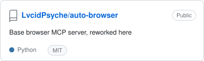
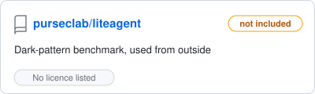
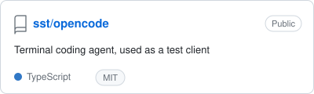
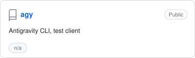
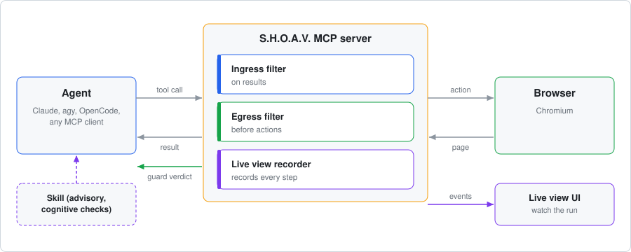
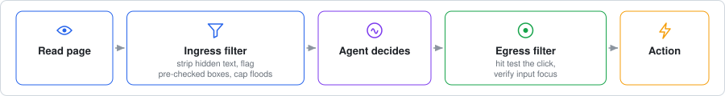
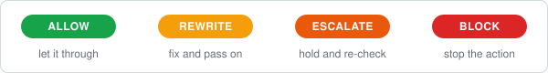
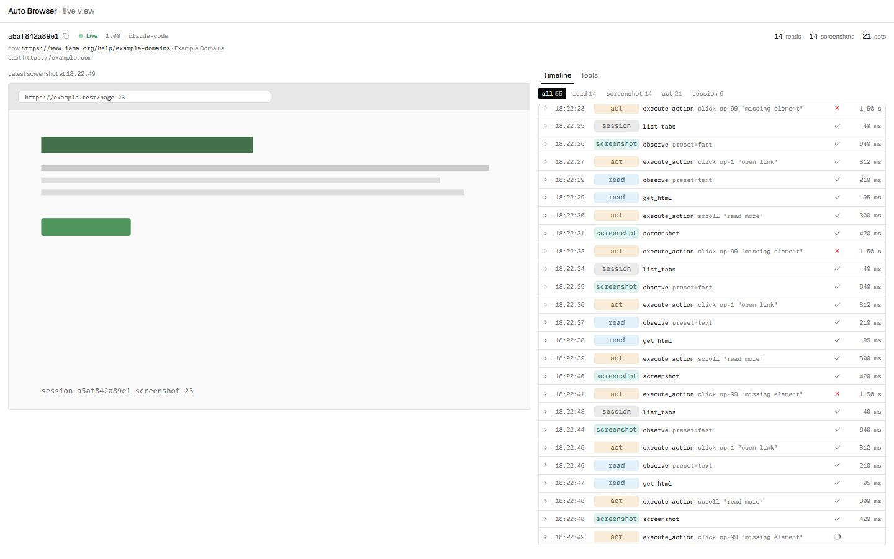

<div align="center">

<table align="center">
  <tr>
    <td align="left" valign="middle">
      <h1>S.H.O.A.V.</h1>
      <b>S</b>hield for <b>H</b>ostile <b>O</b>perations &amp; <b>A</b>gent <b>V</b>ulnerability
    </td>
    <td align="center" valign="middle">
      <h2>AI<br>BODYGUARD</h2>
    </td>
  </tr>
</table>

<br>


<br>

<a href="docs/DESIGN.md">Design</a> &nbsp;·&nbsp;
<a href="AGENTS.md">Connect an agent</a> &nbsp;·&nbsp;
<a href="shoav-skill/">Skill</a> &nbsp;·&nbsp;
<a href="docs/research/">Research</a>

<br>

</div>

An MCP server that gives any agent a real browser with a bodyguard in the path. It stops deceptive interfaces and
injected instructions before the agent acts on them. Think of it as a seatbelt for web agents. Pronounced "shop".

> [!NOTE]
> The four detection targets come from research and are measured against synthetic attack and benign pages. Thresholds are
> heuristics until they are tuned on real traffic. See [Honest limits](docs/DESIGN.md#8-honest-limits).

---

## Built on

<table>
  <tr>
    <td><a href="https://github.com/LvcidPsyche/auto-browser"><picture><source media="(prefers-color-scheme: dark)" srcset="assets/readme/card-auto-browser-dark.svg"></picture></a></td>
    <td><a href="https://github.com/purseclab/liteagent"><picture><source media="(prefers-color-scheme: dark)" srcset="assets/readme/card-liteagent-dark.svg"></picture></a></td>
  </tr>
  <tr>
    <td><a href="https://github.com/sst/opencode"><picture><source media="(prefers-color-scheme: dark)" srcset="assets/readme/card-opencode-dark.svg"></picture></a></td>
    <td><picture><source media="(prefers-color-scheme: dark)" srcset="assets/readme/card-agy-dark.svg"></picture></td>
  </tr>
</table>

Auto Browser is MIT licensed and is included here in reworked form with its licence and credit. LiteAgent has no licence,
so none of its code is in this repo. agy is the reference test client. OpenCode is a further target.

## The problem

Developers now give AI agents a browser: coding agents, research agents, and automation agents reached through MCP.
Agents read the DOM or the pixels, not the way a person looks at a page, and hostile or deceptive pages exploit that.
Hidden text instructs the agent, invisible layers sit over the real button, boxes are ticked before the agent arrives,
and pages are stuffed to flood the agent's context.

Existing defenses are either an LLM judging the content, which the page can talk out of its warning, or a plugin tied to
one specific agent. There is no deterministic safety boundary between the model and untrusted web pages that works with
whatever agent you run.

S.H.O.A.V. is a browser MCP server with a deterministic guard in the path, plus a portable skill for agents that keep their
own browser. Any MCP capable agent can use it, and a human can watch every session in a live view.

## Our approach: Tool-First Agent Diagnostic Design

Put the guard where every agent has to pass, at the browser. One MCP server owns the browser and checks each step.

<p align="center"><picture>
  <source media="(prefers-color-scheme: dark)" srcset="assets/readme/architecture-dark.svg">
  
</picture></p>

- **A tool, not a plugin.** Most agents have no browser and cannot be extended, and the ones that can are each different.
  So the browser is the product. Claude, agy, OpenCode or any MCP client can use it, and it can be hosted once for everyone
  on your network. It is not locked to one agent.
- **Deterministic core.** The checks look at structure that page text cannot argue with: what is under the click, what is
  visible, what a form will submit. A model may advise, and it can only raise suspicion, never lower it.
- **Skill for the rest.** Agents that already have their own browser can use the S.H.O.A.V. skill. The skill is advice, the
  MCP is enforcement, and they work best together.

<p align="center"><picture>
  <source media="(prefers-color-scheme: dark)" srcset="assets/readme/pipeline-dark.svg">
  
</picture></p>

## What it stops

| | Trap | What the guard does |
|---|---|---|
| 1 | Hidden text that tries to instruct the agent | Removes it before the agent reads the page |
| 2 | Invisible layer over the real button | Aborts the click and says why |
| 3 | Consent boxes ticked in advance | Flags them, and stops a submit that leaves them untouched |
| 4 | Pages stuffed to flood the agent's context | Caps and blocks the flood |

Every result is one of four verdicts:

<p align="center"><picture>
  <source media="(prefers-color-scheme: dark)" srcset="assets/readme/verdicts-dark.svg">
  
</picture></p>

## Quick start

You need Python 3.11+, Node.js (for the live view only) and Chromium (`python -m playwright install chromium`).

```powershell
# 1. start the MCP. Guard mode is off, observe or enforce
cd shoav-mcp\MCP\auto-browser
powershell -NoProfile -ExecutionPolicy Bypass -File scripts\start-local.ps1 -Port 18500 -Guard enforce -Background

# 2. start the live view (second terminal, from shoav-mcp\MCP\auto-browser\live-ui)
npm install; npm run build; npm start

# 3. connect an agent
agy mcp add --type http auto-browser http://127.0.0.1:18500/mcp
```

Every session prints a watch link like `http://127.0.0.1:3200/s/<id>`. Open it to see the agent work. Per-agent setup is in
[`AGENTS.md`](AGENTS.md). Design, limits and evidence are in [`docs/DESIGN.md`](docs/DESIGN.md).

Try the guard without an agent: `python shoav-mcp/t5_e2e/run_t5.py --controller http://127.0.0.1:18500 --fixture-port 18631 --mode enforce`
serves the synthetic attack pages and prints a pass or fail line per check.

## The MCP

`shoav-mcp/MCP/` is a reworked [Auto Browser](https://github.com/LvcidPsyche/auto-browser): one server that owns a real
Chromium and speaks MCP over HTTP. We kept its browser control and added:

- **The guard** in the tool gateway, behind `SHOAV_GUARD_MODE=off|observe|enforce`. Off costs nothing. Observe logs and
  annotates but never changes a result. Enforce rewrites and blocks. A crashing filter fails open unless
  `SHOAV_GUARD_FAIL=closed`.
- **A live view** per session: every tool call, the latest screenshot, guard badges, and a read-only archive afterwards.
- **Tool profiles.** 37 curated tools by default, 74 full, or a 10 tool minimal profile (`MCP_TOOL_PROFILE=minimal`) that keeps the
  tool list small for the agent. Names use underscores so `agy` accepts them.
- **A CLI** for humans: `python shoav-mcp/MCP/shoav/cli.py status`, `create-session`, `events <id>`.
- **Native run.** No Docker, visible browser, one start script.

Where the guard hooks in: egress before the click or drag handler runs, ingress after observe, snapshot, find elements and
get HTML return. A rewrite lands in both the text and the structured half of the MCP result, because different clients read
different halves.

Measured on 2026-09-26 (real Chromium, synthetic pages):

| Guard mode | Checks passed |
|---|---|
| off (attacks succeed, no guard markers) | 22 / 22 |
| observe (notes only) | 17 / 17 |
| enforce (rewrite and block) | 27 / 27 |

A real `agy` run confirmed hidden text stripped and the overlay click blocked with no retry by the agent. Suites: 268 tests for
filters, connectors and CLI, 1148 for the controller, plus live UI lint, typecheck and vitest. Full report:
[`shoav-mcp/MCP/REPORT.md`](shoav-mcp/MCP/REPORT.md).

## The skill

`shoav-skill/` is for agents that already have a browser and cannot be pointed at ours. It is a portable defence manual
(`SKILL.md`) built on invariants: WCAG contrast maths, coordinate hit tests, zero-default form auditing and semantic
normalisation, plus fallback audit scripts for bare environments.

```bash
node shoav-skill/bin/cli.js --target claude    # or cursor, agy
```

The skill covers what a structural check cannot: confirmshaming, fake urgency, trick wording. It is advice. The MCP is
enforcement. Use both when you can. Details in [`shoav-skill/README.md`](shoav-skill/README.md).

## Repository

```
shoav-mcp/
  filters/      the guard core: pure Python rules, probes, session state, tests
  connectors/   adapters between MCP payloads and the filters
  MCP/          the browser MCP (auto-browser/), live UI, CLI, agent templates, plan and report
  fixtures/     tiny synthetic attack and benign pages
  t5_e2e/       end to end runner for off, observe and enforce
shoav-skill/    agent skill, audit scripts, npx installer
web/            the project website
docs/           design notes and research
assets/         images
AGENTS.md       how any agent connects
```

## See what your agent is doing

Every session gets a link. Watch each tool call, what the agent read, what it clicked, and what the guard did about it.

<p align="center"><picture>
  <source media="(prefers-color-scheme: dark)" srcset="assets/screens/02-live-dark.png">
  
</picture><br><sub>The live view of an agent session. Guard badges appear on the tool rows.</sub></p>

## Tech stack

<table>
  <tr><td><b>Guard core</b></td><td> </td></tr>
  <tr><td><b>MCP server</b></td><td> </td></tr>
  <tr><td><b>Browser</b></td><td> </td></tr>
  <tr><td><b>Live view</b></td><td> </td></tr>
  <tr><td><b>State</b></td><td> <sub>audit, approvals, per-session timelines. All local.</sub></td></tr>
  <tr><td><b>Skill</b></td><td>  <sub>npx installer</sub></td></tr>
  <tr><td><b>Tests</b></td><td>  </td></tr>
  <tr><td><b>Test clients</b></td><td></td></tr>
</table>

<sub>Python 3.11+ for the server. The guard rules are pure functions over plain data, so each one is testable without a browser.</sub>

## Where we are

| Part | State |
|------|-------|
| Detection core `shoav-mcp/filters/` | Done. Tested, JS probes verified in a real browser. |
| Browser MCP `shoav-mcp/MCP/` | Working natively with a live view. |
| Guard wiring | Done. Hooked into the gateway, 27 / 27 enforce checks, real `agy` run confirmed. |
| Skill `shoav-skill/` | Done. Portable manual, audit scripts, `npx` installer. |
| Status | Alpha, under active development. See the roadmap above. |

## Roadmap

What is next, in no fixed order:

- Live DOM mutation-rate feed for the flood check
- Iframe and Shadow DOM hit testing
- Tune thresholds on real page traffic
- ESCALATE instead of BLOCK for legitimate modals
- Measure more agent clients (Claude Code, OpenCode)
- Rename the server identity from `auto-browser` to `shoav`
- Publish the skill package to npm
- Evaluate against public agent benchmarks such as TrickyArena

<details>
<summary>Why a deterministic core instead of asking a model?</summary>

A model can be talked out of a warning by the page it is reading. Structural checks cannot: the page either has an
element under the click or it does not. A model may advise, and it can only raise suspicion, never lower it.

</details>

<details>
<summary>My agent already has a browser. Do I need the MCP?</summary>

You can use the skill alone for advice, but only the MCP enforces. If you can, point the agent at the MCP instead.

</details>

<details>
<summary>What is out of scope?</summary>

Language-level tricks such as fake urgency (the skill covers those), text inside images, and cart-level checks that are
site specific. See the design notes for the full list.

</details>

---

<br>

<div align="center">

**[Vassu-V](https://github.com/Vassu-V)**
&nbsp;&nbsp;·&nbsp;&nbsp;
**[str-VaibhavThakkar](https://github.com/str-VaibhavThakkar)**

<br>

<sub>No agents were tricked into a free trial during the making of this project.<br>
Several were tempted.</sub>

<br>

</div>
