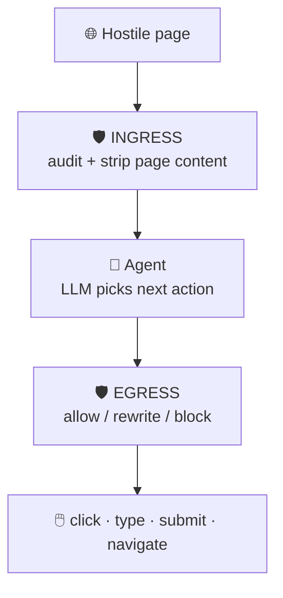

# 📘 Project Context

Single source of truth for **AI Bodyguard**. It consolidates earlier session decisions,
what the codebase and research actually contain, and the last saved project memory.
The problem statement is in [`README.md`](README.md).

**Jump to:**
[Snapshot](#-snapshot) ·
[Thesis](#-thesis) ·
[Architecture](#-architecture) ·
[Reset](#-why-the-first-attempt-was-reset) ·
[Research](#-research-state) ·
[Targets](#-detection-targets) ·
[Auto Browser](#-auto-browser-integration) ·
[Benchmark](#-benchmark-trickyarena) ·
[Open questions](#-open-questions) ·
[Runtime](#-runtime-and-demo) ·
[Team](#-team-and-split) ·
[Memory](#-last-saved-memory)

---

## 📌 Snapshot

| | Item | State |
|:-:|------|-------|
| 🏆 | Event | Genesis Fest 2026, **Track 3** (AI Bodyguard) |
| ⏱️ | Format | 48-hour hackathon, kickoff Thu 2026-09-24 08:30 |
| 📅 | Deadlines | Report + 3-min video **Fri 2026-09-25 23:30**, in-person rounds **Sat 2026-09-26** |
| 🧭 | Phase | Research complete, build not started |
| 🔀 | Direction | Clean restart, research-first, proxy MCP |
| 🗄️ | Prototype | `track3/` is superseded. Do not build on it |
| 🌿 | Repo | Git on `main`, no remote configured |

### 🏅 Scoring rubric

| UI/UX | Functionality | Demo | Round 2 bonus |
|:-:|:-:|:-:|:-:|
| **30** | **30** | **15** | **+30** live problem solving |

> Polish and the ability to explain our own code matter as much as the engine.

---

## 💡 Thesis

> Most defenses against adversarial web content are language models reading
> attacker-controlled text. **An LLM guard can be prompt-injected by the page it is
> inspecting.**

| | Decision | Why |
|:-:|----------|-----|
| 🧱 | Core is **deterministic and structural** | An overlay covers a button or it does not. Text is invisible or it is not. |
| 🪢 | LLM is **advisory, escalate-only** | It may raise an alarm, never clear one. |
| 🛟 | Failure mode is a false positive | Injecting the guard cannot cause a bypass. |
| 🔋 | Works without quota | Free-tier limits do not disable the defense. |

The literature backs this: guardrail LLMs were bypassed at up to 100% evasion
(Hackett et al.), and LLM-as-judge defenses fail against adaptive attackers.

---

## 🏗️ Architecture

A **proxy MCP server** in front of a browser MCP server:

1. Re-expose the browser MCP tool surface unchanged.
2. **Egress:** audit each action before forwarding.
3. **Ingress:** sanitize page content and results on the way back.
4. Emit structured safety telemetry for the agent planner.

> ⚠️ **Load-bearing requirement:** the browser MCP must expose a **JS-evaluate**
> capability. Without it we cannot run the snapshot extractor for computed styles,
> bounding boxes and hit-testing, and the deterministic core goes blind.

---

## ♻️ Why the first attempt was reset

The `track3/` benchmark was **circular**: we wrote both the attacks and the detector,
so the detector matched our own keyword lists.

| Structural (generalizes) ✅ | Lexicon-anchored (does not) ❌ |
|-----------------------------|--------------------------------|
| Hit-test geometry | Keyword lists |
| Computed-style visibility | Phrase matching |
| Amount arithmetic | |
| Origin comparison, provenance | |

The sealed holdout, the only non-circular evidence, never produced a result.

**Rules carried forward**

- 📚 Ground the attack taxonomy in published research before building detectors.
- 🧑‍⚖️ The team that writes the detector must not write the test.
- ✅ **Pass = task completed AND zero compromise events.** Otherwise a guard that
  blocks everything scores perfectly.

---

## 🔬 Research state

Workstreams live in [`research/`](research). Read `08-synthesis/SYNTHESIS.md` first,
then `09-verification-closeout/CLOSEOUT.md`.

### 📊 Key findings

| | Finding |
|:-:|---------|
| 🕸️ | A crawl of ~1.2B URLs found **15,300** validated injections. About **70%** sit in non-rendered HTML: invisible to humans, readable by agents. |
| 🚨 | Exactly **one** confirmed real-world incident (Unit 42, Dec 2025). Press-covered cases are disclosed proofs of concept. |
| 🎭 | **DECEPTICON:** dark patterns steer agents in over **70%** of 700 tasks vs a **31%** human baseline. |
| 📈 | **Ersoy et al.:** ~**41%** susceptibility per pattern, compounding when stacked. |
| ⬆️ | Susceptibility **rises** with model size and reasoning budget. Today's safety is agent incompetence, not defense. |
| ⚖️ | ProtectAI classifier: attack success **7.95%**, but utility fell **83% → 41%**. Judge a detector on task completion. |
| 🕳️ | No published deterministic detector evaluated on general deceptive UI in an agent pipeline. **That gap is our contribution.** |

<b>⚠️ Citation rules (from CLOSEOUT.md)</b>

- Do **not** cite arXiv:2503.00061 for "12 defenses, over 90%". That belongs to
  arXiv:2510.09023. 2503.00061 supports "8 defenses, over 50%".
- No success-rate percentage for the GCG accessibility-tree attack.
- Say Ersoy et al. is "accepted to appear at IEEE S&P 2026", not "published".
- Name A-11 (arXiv:2604.12371) as a workshop paper.
- Replace the edgemesh blog with Balduzzi et al., ASIACCS 2010.
- Do not present promptinjectionradar as evidence of adoption or effectiveness.
- Two ACM-hosted dark-pattern papers were not readable in full. Attribute only what
  other sources corroborate.

---

## 🎯 Detection targets

Ranked in `research/08-synthesis/DETECTION_TARGETS.md`.

| Tier | Target | Signal |
|:-:|--------|--------|
| 🟢 1 | Hidden or invisible instruction content | Computed style, off-screen, zero size, contrast, zero-width Unicode, vs what the agent consumed |
| 🟢 1 | Overlay and hit-target mismatch | `elementFromPoint` at target center and corners vs intended element |
| 🟢 1 | Pre-checked form state | Checked defaults on opt-ins, recurring billing flags |
| 🟡 2 | Late-appearing costs (drip pricing) | DOM-injected price changes across steps |
| 🟡 2 | Obstructed cancellation | Step-count asymmetry, sign-up vs cancel |
| ⚪ 3 | Confirmshaming, visual misdirection, fake urgency | Out of scope this weekend |

> 💬 False positives are real for hidden content (screen-reader text, accordions, lazy
> loading). The rule must be **"hidden AND instructional"**, never "hidden" alone.

---

## 🔌 Auto Browser integration

`research/06-autobrowser/` evaluated [`LvcidPsyche/auto-browser`](https://github.com/LvcidPsyche/auto-browser).

| | Point |
|:-:|-------|
| 🕳️ | No clickjacking or dark-pattern defense. Its click path fires raw mouse events at a bounding-rect coordinate and **bypasses Playwright's own hit-test**. |
| ✅ | **Recommended:** wrap `McpToolGateway.call_tool()` (`controller/app/tool_gateway/gateway.py`) with no fork, or run an external proxy on port 8000. |
| 🔒 | Add internal-only `hit_test(x, y)` and `style_probe(target)`. The agent must never invoke or spoof them. |
| 📝 | Report via existing but unused `WitnessConcern` records plus `audit.append()`. |
| 🚫 | Do not duplicate approval gates, PII scrubbing, protection profiles or rate limits. |

Clone path: `external/auto-browser` (git-ignored, pinned near `aa99c42`).

---

## 🧪 Benchmark: TrickyArena

`research/07-trickyarena/`

| | Finding |
|:-:|---------|
| 🌐 | Hosted site is live, driven by `?dp=<code>`, **14** dark patterns across **4** sites. |
| 🖱️ | Scoring is click-based and structural, not outcome-based. |
| ⛔ | **License blocker:** LiteAgent repos have no license. Do not vendor or fork. |
| ✅ | Driving the hosted pages with our own agent and scoring independently is fine. |

---

## ❓ Open questions

Highest risk first, from `research/08-synthesis/OPEN_QUESTIONS.md`.

| # | Question | Risk |
|:-:|----------|:-:|
| 1 | Does structural detection work on general deceptive UI, or only hidden text? The whole project is staked on this. | 🔴 High |
| 2 | False-positive rate per rule on ordinary sites? Cheap: test 20 to 50 sites before Tier 2. | 🟠 Medium |
| 3 | Does blocking preserve task utility for our design? | 🟠 Medium |
| 4 | Should the advisory LLM see the whole page or only flagged content? | 🟡 |
| 5 | Which modality does the agent use: DOM, accessibility tree, or pixels? | 🟡 |
| 6 | Are the headline attack-success numbers comparable across papers? | 🟡 |
| 7 | Does susceptibility vary by pattern type for agents? | 🟡 |

---

## ⚙️ Runtime and demo

| | Item | Detail |
|:-:|------|--------|
| 🤖 | Demo agent | **`agy`** (Antigravity CLI), authenticated, `-p` print mode, `--json-schema`. ~25 s and ~30k tokens per step on Antigravity quota. Claude Code is **not** the demo vehicle. |
| 💸 | Runtime budget | Gemini free tier (~100 to 300 req/day) and OpenRouter. Claude and Antigravity are build-time only. |
| 💻 | Hardware | No discrete GPU, 16 GB RAM. Keep any single model under ~8 GB. Python 3.10 default. |
| 🔐 | Data safety | No real credentials, all test data synthetic, nothing aimed at real third-party sites. |

---

## 👥 Team and split

GitHub: **`Vassu-V`** and **`str-VaibhavThakkar`**. Two people, high-school age, strong in
web and frontend, Playwright/Puppeteer, Node and Python. No deep cryptography or graph
theory background.

- 🕸️ The teammate owns the **malicious test website**. We do not build attack sites.
- 🧭 Natural split: harness and guard layers on one side, dashboard and frontend on the other.

<b>🔒 Blind holdout protocol (sound, never executed)</b>

A sealed site built by an isolated agent reports trap events to a local oracle
endpoint. Behavior is readable, source is not. It needs a public dev site and a sealed
holdout site, and gets **one** use for the headline result after the guard is frozen.

---

## 🗺️ Repository map

| Path | Contents |
|------|----------|
| `README.md` | Problem statement and dispatcher |
| `context.md` | This file |
| `research/00-shared` | `BRIEF.md`, shared research brief |
| `research/01` to `04` | Attacks, dark patterns, prevalence, mitigations |
| `research/05-citations` | Bibliography and verification |
| `research/06-autobrowser` | Findings and integration recommendation |
| `research/07-trickyarena` | Benchmark feasibility |
| `research/08-synthesis` | Synthesis, detection targets, open questions |
| `research/09-verification-closeout` | Claims safe and unsafe to cite |
| `track3/` | Superseded prototype (guard, harness, adapters, dashboard, bench) |
| `external/` | Git-ignored third-party clones |
| `assets/` | Tracked images |

---

## 🧠 Last saved memory

As of 2026-09-24:

- ♻️ Clean restart called, `track3/` prototype superseded.
- 🔌 Proxy MCP architecture, `agy` as demo runner, JS-evaluate tool is the key filter.
- 🧹 Old Track 4 off-limits note was stale and is corrected.
- 🔒 Blind-holdout kept as a method, never executed.
- 🔑 Commit identity `vassu-v`. Never push without explicit instruction, no Claude co-author lines.
