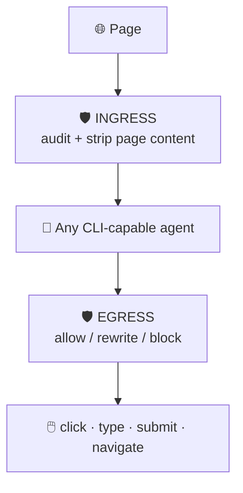

<table align="center">
  <tr>
    <td align="left" valign="middle">
      PRONOUNCED &ldquo;SHOP&rdquo;
      <h1>S.H.O.A.V.</h1>
      <b>S</b>hield for <b>H</b>ostile <b>O</b>perations &amp; <b>A</b>gent <b>V</b>ulnerability
    </td>
    <td align="center" valign="middle">
      <h2>AI BODYGUARD</h2>
    </td>
  </tr>
</table>

### Project Context

Single source of truth for **S.H.O.A.V.** (Shield for Hostile Operations & Agent
Vulnerability, pronounced "shop", tagline "AI Bodyguard"). It consolidates earlier
session decisions, what the codebase and research actually contain, and the last saved
project memory. The problem statement is in [`README.md`](README.md).

**Jump to:**
[Snapshot](#-snapshot) ·
[Thesis](#-thesis) ·
[Architecture](#-architecture) ·
[Reset](#-why-the-first-attempt-was-reset) ·
[Research](#-research-state) ·
[Auto Browser](#-auto-browser-integration) ·
[Codebase](#-codebase-understanding) ·
[Benchmark](#-benchmark-trickyarena) ·
[Open questions](#-open-questions) ·
[Runtime](#-runtime-and-demo) ·
[Team](#-team-and-split) ·
[Memory](#-last-saved-memory)

---

## 📌 Snapshot

| | Item | State |
|:-:|------|-------|
| 🏆 | Event | Genesis Hackathon 2026, **Track 03** (AI Bodyguard, codename S.H.O.A.V.) |
| ⏱️ | Format | 48-hour hackathon, kickoff Thu 2026-09-24 08:30 |
| 📅 | Deadlines | Report + 3-min video **Fri 2026-09-25 23:30**, in-person rounds **Sat 2026-09-26** |
| 🧭 | Phase | Research complete, build not started |
| 🔀 | Direction | Clean restart, research-first, extend Auto Browser |
| 🗄️ | Prototype | `track3/` is superseded. Do not build on it |
| 🌿 | Repo | Git on `main`. Target remote `github.com/vassu-v/sphs-genesis` (nothing pushed; push only on explicit instruction) |
| 🧱 | Built so far | Research notes and a local clone of Auto Browser. No guard code yet |

### 🏅 Scoring rubric

| UI/UX | Functionality | Demo | Round 2 bonus |
|:-:|:-:|:-:|:-:|
| **30** | **30** | **15** | **+30** live problem solving |

> Polish and the ability to explain our own code matter as much as the engine.

---

## 💡 Thesis

> Most defenses against adversarial web content are language models reading
> attacker-controlled text. **An LLM guard can be prompt-injected by the page it is
> inspecting.**

| | Decision | Why |
|:-:|----------|-----|
| 🧱 | Core is **deterministic and structural** | An overlay covers a button or it does not. Text is invisible or it is not. |
| 🪢 | LLM is **advisory, escalate-only** | It may raise an alarm, never clear one. |
| 🛟 | Failure mode is a false positive | Injecting the guard cannot cause a bypass. |
| 🔋 | Works without quota | Free-tier limits do not disable the defense. |

The literature backs this: guardrail LLMs were bypassed at up to 100% evasion
(Hackett et al.), and LLM-as-judge defenses fail against adaptive attackers.

---

## 🏗️ Architecture

We are **not** building a standalone proxy MCP. We build on
[Auto Browser](https://github.com/LvcidPsyche/auto-browser), an existing MCP-native
browser control plane, and add the guard inside or in front of it.

**Reach model:** any agent that can run a CLI command (or speak MCP over HTTP or the
`uvx auto-browser-mcp` stdio bridge) can use the browser and get the guard for free.
Agents with their own built-in browser will not pick it up automatically, but can
trigger it manually from the CLI. Maximum compatibility is the goal.

Guard outline:

1. **Egress:** audit each action before it runs.
2. **Ingress:** sanitize page content and results on the way back.
3. Emit structured safety telemetry for the agent planner.

> ⚠️ **Load-bearing requirement:** the browser layer must expose a **JS-evaluate**
> capability, needed for computed styles, bounding boxes and hit-testing.
> Auto Browser has one, but it is approval-gated (see the integration section).

---

## ♻️ Why the first attempt was reset

The `track3/` benchmark was **circular**: we wrote both the attacks and the detector,
so the detector matched our own keyword lists.

| Structural (generalizes) ✅ | Lexicon-anchored (does not) ❌ |
|-----------------------------|--------------------------------|
| Hit-test geometry | Keyword lists |
| Computed-style visibility | Phrase matching |
| Amount arithmetic | |
| Origin comparison, provenance | |

The sealed holdout, the only non-circular evidence, never produced a result.

**Rules carried forward**

- 📚 Ground the attack taxonomy in published research before building detectors.
- 🧑‍⚖️ The team that writes the detector must not write the test.
- ✅ **Pass = task completed AND zero compromise events.** Otherwise a guard that
  blocks everything scores perfectly.

---

## 🔬 Research state

Workstreams live in [`research/`](research). Read `08-synthesis/SYNTHESIS.md` first,
then `09-verification-closeout/CLOSEOUT.md`.

### 📊 Key findings

| | Finding |
|:-:|---------|
| 🕸️ | A crawl of ~1.2B URLs found **15,300** validated injections. About **70%** sit in non-rendered HTML: invisible to humans, readable by agents. |
| 🚨 | Exactly **one** confirmed real-world incident (Unit 42, Dec 2025). Press-covered cases are disclosed proofs of concept. |
| 🎭 | **DECEPTICON:** dark patterns steer agents in over **70%** of 700 tasks vs a **31%** human baseline. |
| 📈 | **Ersoy et al.:** ~**41%** susceptibility per pattern, compounding when stacked. |
| ⬆️ | Susceptibility **rises** with model size and reasoning budget. Today's safety is agent incompetence, not defense. |
| ⚖️ | ProtectAI classifier: attack success **7.95%**, but utility fell **83% → 41%**. Judge a detector on task completion. |
| 🕳️ | No published deterministic detector evaluated on general deceptive UI in an agent pipeline. **That gap is our contribution.** |

<b>⚠️ Citation rules (from CLOSEOUT.md)</b>

- Do **not** cite arXiv:2503.00061 for "12 defenses, over 90%". That belongs to
  arXiv:2510.09023. 2503.00061 supports "8 defenses, over 50%".
- No success-rate percentage for the GCG accessibility-tree attack.
- Say Ersoy et al. is "accepted to appear at IEEE S&P 2026", not "published".
- Name A-11 (arXiv:2604.12371) as a workshop paper.
- Replace the edgemesh blog with Balduzzi et al., ASIACCS 2010.
- Do not present promptinjectionradar as evidence of adoption or effectiveness.
- Two ACM-hosted dark-pattern papers were not readable in full. Attribute only what
  other sources corroborate.

---

## 🔌 Auto Browser integration

`research/06-autobrowser/` evaluated [`LvcidPsyche/auto-browser`](https://github.com/LvcidPsyche/auto-browser).

| | Point |
|:-:|-------|
| 🕳️ | No clickjacking or dark-pattern defense. Its click path fires raw mouse events at a bounding-rect coordinate and **bypasses Playwright's own hit-test**. |
| ✅ | **Recommended:** wrap `McpToolGateway.call_tool()` (`controller/app/tool_gateway/gateway.py`) with no fork, or run an external proxy on port 8000. |
| 🔒 | Add internal-only `hit_test(x, y)` and `style_probe(target)`. The agent must never invoke or spoof them. |
| 📝 | Report via existing but unused `WitnessConcern` records plus `audit.append()`. |
| 🚫 | Do not duplicate approval gates, PII scrubbing, protection profiles or rate limits. |

Clone path: `external/auto-browser` (git-ignored, pinned near `aa99c42`).

---

## 🧭 Codebase understanding

What is actually in the repository, read from the code rather than from notes.

### `external/auto-browser` (the base we extend)

MIT-licensed, Python controller plus a Node `browser-node` service, Docker Compose to
run. Its layout under `controller/app/`:

| Area | Where | Why it matters to us |
|------|-------|----------------------|
| MCP entry point | `tool_gateway/gateway.py` (~850 lines), `registry.py`, `mcp_transport.py`, `mcp_stdio.py` | Every MCP call funnels through `McpToolGateway.call_tool()`. Best interception point. |
| Click path | `browser/services/actions.py` | Raw mouse events at a bounding-rect coordinate, skips Playwright's actionability check. This is the gap we fill. |
| In-page scripts | `browser_scripts.py` (`INTERACTABLES_SCRIPT`) | Template for our `hit_test` and `style_probe`. Its `isVisible()` filter drops invisible elements, which we specifically want to see. |
| Evidence and audit | `witness.py`, `witness_anchor.py`, `audit.py` | `WitnessConcern` schema exists but nothing fills it from DOM checks. Ready-made reporting channel. |
| Human consent | `approvals.py` | Keyed on the agent's self-declared risk. Orthogonal to us, keep it. |
| Hygiene | `pii_scrub.py`, `rate_limits.py`, `session_isolation.py`, `compliance.py` | Do not duplicate. |
| Other | `agent_jobs.py`, `providers/`, `mesh/`, `stealth/`, `cron_service.py` | Not on our path. `mesh/policy.py` was evaluated and rejected as an interception point. |

Client surfaces: HTTP MCP at `:8000/mcp`, REST at `/mcp/tools` and `/mcp/tools/call`,
stdio bridge via `uvx auto-browser-mcp`, plus `examples/` for Claude Desktop, Cursor,
LangChain and CrewAI. Default tool profile is `curated` (`MCP_TOOL_PROFILE=full` for all).

### `research/`

Ten workstreams, all markdown plus `sources.json` citation registries and per-stream
`LOG.md` files. Reading order: `08-synthesis/SYNTHESIS.md`, then
`09-verification-closeout/CLOSEOUT.md` (which claims are safe to cite), then
`06-autobrowser/INTEGRATION.md` for the engineering plan.

### `track3/` (archived, do not build on it)

The first attempt, kept only as reference. Layout: `guard/` (ingress, L1 structural, L2
policy, L3 semantic, patterns), `harness/` (agents, oracle client, CLI), `adapters/`
(MCP and Playwright shims), `service/` (app), `dashboard/`, `bench/` (oracle logs and
telemetry), `sites/` (dev and sealed holdout). Its L1 structural layer contained the
checks that did generalize. Its keyword layers are the circularity we are avoiding.
Nothing from it is carried into the new build.

### Repo hygiene

- Line endings normalized to LF via `.gitattributes`. The `.editorconfig` was removed.
- `.gitignore` covers npm and Python environments, `.env` files, caches and
  `external/*`. Images are intentionally tracked.
- Target remote is `github.com/vassu-v/sphs-genesis`. Push only when explicitly told.

---

## 🧪 Benchmark: TrickyArena

`research/07-trickyarena/`

| | Finding |
|:-:|---------|
| 🌐 | Hosted site is live, driven by `?dp=<code>`, **14** dark patterns across **4** sites. |
| 🖱️ | Scoring is click-based and structural, not outcome-based. |
| ⛔ | **License blocker:** LiteAgent repos have no license. Do not vendor or fork. |
| ✅ | Driving the hosted pages with our own agent and scoring independently is fine. |

---

## ❓ Open questions

Highest risk first, from `research/08-synthesis/OPEN_QUESTIONS.md`.

| # | Question | Risk |
|:-:|----------|:-:|
| 1 | Does structural detection work on general deceptive UI, or only hidden text? The whole project is staked on this. | 🔴 High |
| 2 | False-positive rate per rule on ordinary sites? Cheap: test 20 to 50 sites before Tier 2. | 🟠 Medium |
| 3 | Does blocking preserve task utility for our design? | 🟠 Medium |
| 4 | Should the advisory LLM see the whole page or only flagged content? | 🟡 |
| 5 | Which modality does the agent use: DOM, accessibility tree, or pixels? | 🟡 |
| 6 | Are the headline attack-success numbers comparable across papers? | 🟡 |
| 7 | Does susceptibility vary by pattern type for agents? | 🟡 |

---

## ⚙️ Runtime and demo

| | Item | Detail |
|:-:|------|--------|
| 🤖 | Demo agent | **`agy`** (Antigravity CLI), authenticated, `-p` print mode, `--json-schema`. ~25 s and ~30k tokens per step on Antigravity quota. Claude Code is **not** the demo vehicle. |
| 💸 | Runtime budget | Gemini free tier (~100 to 300 req/day) and OpenRouter. Claude and Antigravity are build-time only. |
| 💻 | Hardware | No discrete GPU, 16 GB RAM. Keep any single model under ~8 GB. Python 3.10 default. |
| 🔐 | Data safety | No real credentials, all test data synthetic, nothing aimed at real third-party sites. |

---

## 👥 Team and split

GitHub: **`Vassu-V`** and **`str-VaibhavThakkar`**. Two people, high-school age, strong in
web and frontend, Playwright/Puppeteer, Node and Python. No deep cryptography or graph
theory background.

- 🕸️ The teammate owns the **malicious test website**. We do not build attack sites.
- 🧭 Natural split: harness and guard layers on one side, dashboard and frontend on the other.

<b>🔒 Blind holdout protocol (sound, never executed)</b>

A sealed site built by an isolated agent reports trap events to a local oracle
endpoint. Behavior is readable, source is not. It needs a public dev site and a sealed
holdout site, and gets **one** use for the headline result after the guard is frozen.

---

## 🗺️ Repository map

| Path | Contents |
|------|----------|
| `README.md` | Problem statement and dispatcher |
| `context.md` | This file |
| `research/00-shared` | `BRIEF.md`, shared research brief |
| `research/01` to `04` | Attacks, dark patterns, prevalence, mitigations |
| `research/05-citations` | Bibliography and verification |
| `research/06-autobrowser` | Findings and integration recommendation |
| `research/07-trickyarena` | Benchmark feasibility |
| `research/08-synthesis` | Synthesis, detection targets, open questions |
| `research/09-verification-closeout` | Claims safe and unsafe to cite |
| `track3/` | Superseded prototype (guard, harness, adapters, dashboard, bench) |
| `external/` | Git-ignored third-party clones |
| `assets/` | Tracked images |

---

## 🧠 Last saved memory

As of 2026-09-24:

- ♻️ Clean restart called, `track3/` prototype superseded.
- 🔌 Build on Auto Browser for any CLI-capable agent (not a from-scratch proxy MCP), `agy` as demo runner, JS-evaluate is the key filter.
- 🎯 Detection targets in the research are unconfirmed and research-only. Do not carry over anything from the old `track3/` archive.
- 🧹 Old Track 4 off-limits note was stale and is corrected.
- 🔒 Blind-holdout kept as a method, never executed.
- 🔑 Commit identity `vassu-v`. Never push without explicit instruction, no Claude co-author lines.
