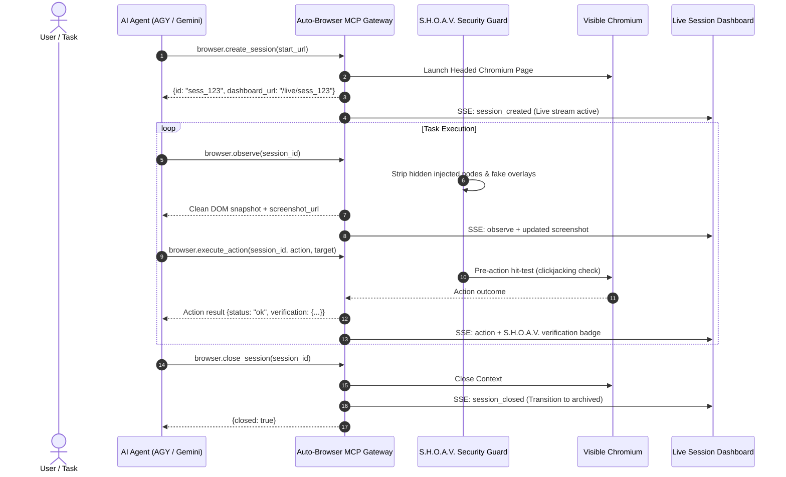

# Universal Agent Integration Guide — Auto-Browser MCP & S.H.O.A.V.

This document serves as the universal reference for AI agents (Antigravity CLI `agy`, Gemini CLI, Claude Code, Cursor, Copilot, etc.) connecting to and controlling browser sessions via the native **Auto-Browser MCP** server.

---

## 1. Connecting to the MCP Server

The auto-browser controller runs locally without Docker at `http://127.0.0.1:8000`.

### Antigravity CLI (`agy`) Configuration
To connect `agy` to the native MCP endpoint:
```bash
agy mcp add --type http auto-browser http://127.0.0.1:8000/mcp
```
To verify connected tools:
```bash
agy mcp list-tools auto-browser
```

### Standard MCP Client JSON (`mcp_config.json` / Claude Desktop / Cursor)
```json
{
  "mcpServers": {
    "auto-browser": {
      "url": "http://127.0.0.1:8000/mcp"
    }
  }
}
```

---

## 2. Core Tool Definitions & Agent Workflows

The auto-browser exposes 40+ MCP tools for browser automation and inspection. The primary execution loop follows:



### Primary Tools

1. **`browser.create_session`**
   - **Arguments**: `{"start_url": "https://example.com"}`
   - **Response**: Returns session metadata including `id` and **`dashboard_url`** (`http://127.0.0.1:8000/live/{session_id}`).
   - *Note*: Running in visible (headed) mode allows humans and judges to see real-time browser actions on screen.

2. **`browser.observe`**
   - **Arguments**: `{"session_id": "...", "limit": 40}`
   - **Response**: Returns page URL, page title, interactable elements with numeric IDs, accessibility tree, and screenshot URL.

3. **`browser.execute_action`**
   - **Arguments**: `{"session_id": "...", "action": "click"|"type"|"press"|"scroll", ...}`
   - **Examples**:
     - Click: `{"session_id": "...", "action": "click", "selector": "#search-button"}` or `{"x": 200, "y": 150}`
     - Type: `{"session_id": "...", "action": "type", "selector": "input[name='q']", "value": "laptop"}`
     - Press key: `{"session_id": "...", "action": "press", "key": "Enter"}`

4. **`browser.screenshot`**
   - **Arguments**: `{"session_id": "...", "label": "step-1"}`
   - **Response**: Saves and returns artifact path and public URL (`/artifacts/{session_id}/step-1.png`).

5. **`browser.close_session`**
   - **Arguments**: `{"session_id": "..."}`
   - **Response**: Closes browser context and finalizes audit trail.

---

## 3. Independent Live Per-Session Dashboard

Every session launched through the MCP automatically provides an independent, live, ephemeral dashboard:

- **URL Pattern**: `http://127.0.0.1:8000/live/{session_id}` or `http://127.0.0.1:8000/sessions/{session_id}/dashboard`
- **Real-Time Feed**: Driven by Server-Sent Events (SSE) at `/sessions/{session_id}/events`.
- **Live Visuals**: Real-time screenshot display with HUD telemetry (viewport, mouse coordinates, active element).
- **Action Timeline**: Every tool call, parameters, execution outcome, and response sent to the agent.
- **S.H.O.A.V. Security Badges**: Indicates whether DOM observations and actions passed hit-test verification and sanitization.
- **Ephemeral Lifecycle**:
  - 🟢 **ACTIVE & LIVE**: As long as the agent is connected and executing.
  - 🔴 **CLOSED / TERMINATED**: Once the session is closed via MCP or destroyed, the dashboard immediately marks the session as terminated and presents an immutable archived record.

---

## 4. Where Changes Are Located in `external/auto-browser/`

All modifications and standalone components are organized strictly inside `external/auto-browser/`:

| Component / File | Purpose |
| :--- | :--- |
| `external/auto-browser/controller/app/browser/services/runtime.py` | Direct headed Chromium Playwright launcher (no Docker required). |
| `external/auto-browser/controller/app/ui/session_dashboard.html` | Sleek, dark-mode glassmorphic per-session live dashboard template. |
| `external/auto-browser/controller/app/routes/session_diagnostics.py` | Route handlers for `/live/{session_id}` and `/sessions/{session_id}/dashboard`. |
| `external/auto-browser/controller/app/browser/services/sessions.py` | Real-time SSE event dispatching (`active`, `closed`) and `dashboard_url` generator. |
| `external/auto-browser/controller/app/browser/services/observation.py` | Real-time screenshot and page event broadcasting to the live dashboard. |
| `external/auto-browser/controller/app/actions/pipeline.py` | Execution pipeline with audit logging and event dispatch. |
| `external/auto-browser/controller/.env` | Local configuration (standalone, port 8000, local artifact storage). |
| `external/auto-browser/AGENTS.md` | Universal agent guidance for MCP usage. |

---

## 5. Starting the MCP Server

To start the controller server:
```powershell
cd external/auto-browser/controller
py -3.12 -m uvicorn app.main:app --host 127.0.0.1 --port 8000
```
- Admin Dashboard: `http://127.0.0.1:8000/dashboard`
- MCP Endpoint: `http://127.0.0.1:8000/mcp`
- Live Session View: `http://127.0.0.1:8000/live/<session_id>`
