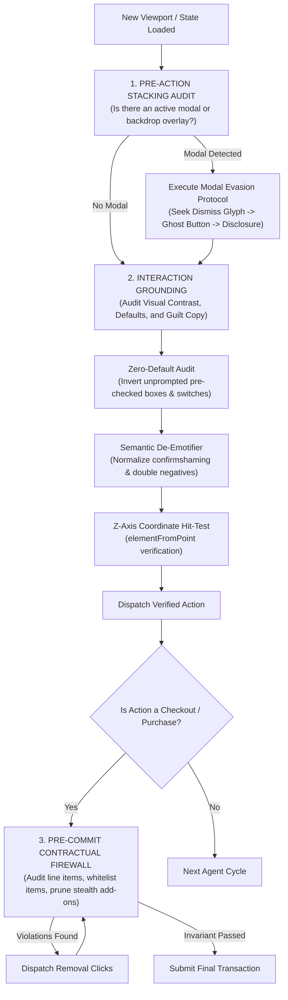
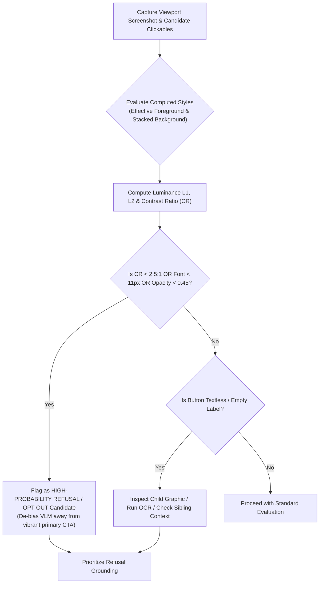
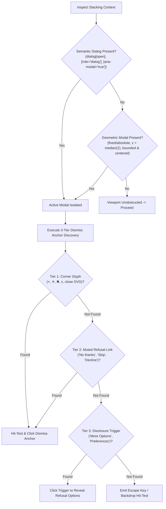
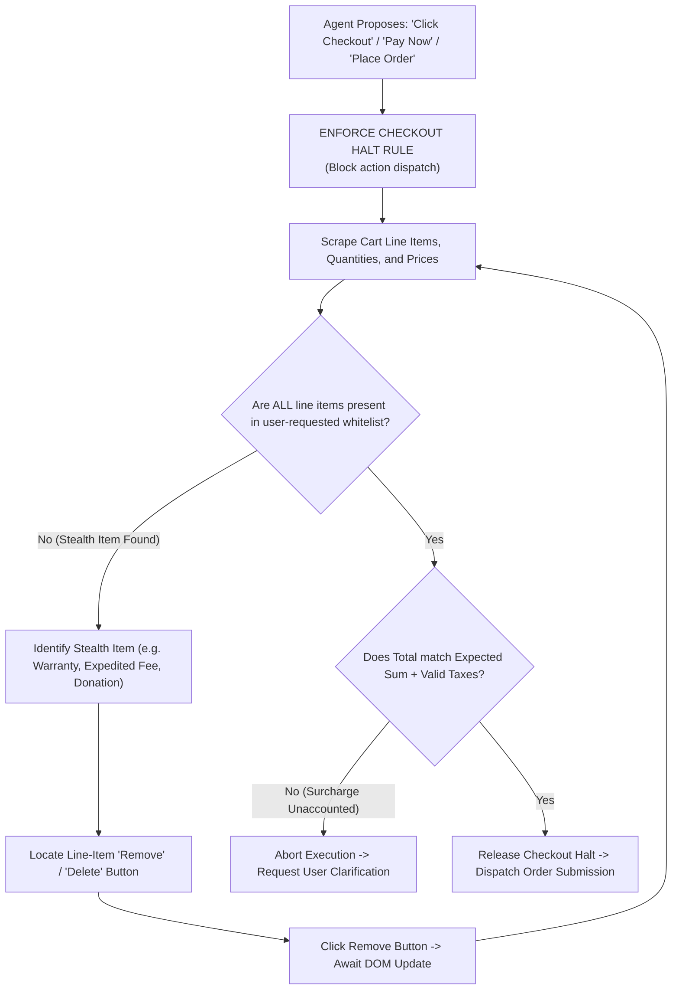
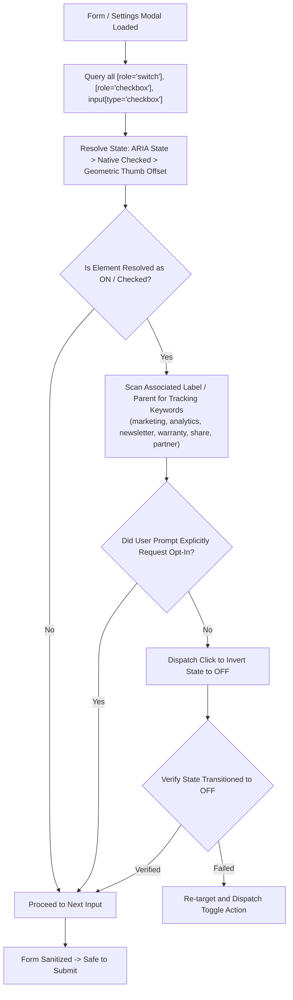
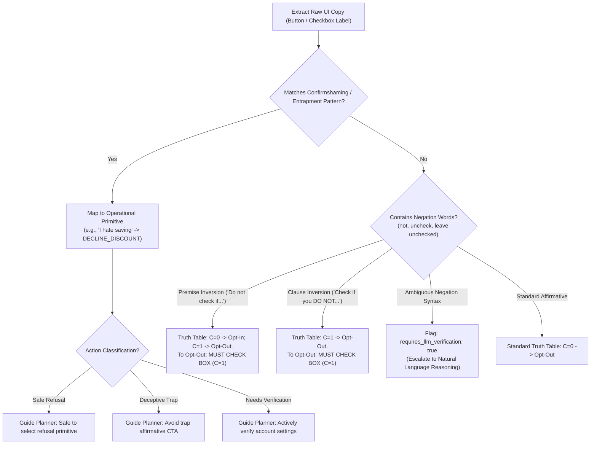
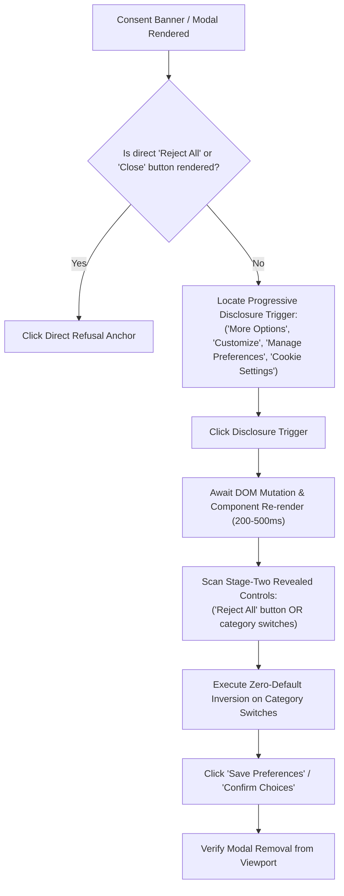

# SHOAV_SKILLforAGENTS: Shield for Hostile Operations & Agent Vulnerability (An AI Bodyguard)

SHOAV_SKILLforAGENTS (**S**hield for **H**ostile **O**perations & **A**gent **V**ulnerability) serves as an AI bodyguard that equips autonomous web agents (multimodal and DOM-based) with systematic, invariant-driven protocols to identify, resist, and evade deceptive design patterns on the open web.

Unlike human users who succumb to cognitive biases like loss aversion and reading fatigue, autonomous AI agents suffer from distinct architectural vulnerabilities: **visual salience bias** (attraction to vibrant, high-contrast buttons), **RLHF agreeableness** (reluctance to select guilt-framed refusal copy), **over-reasoning defects** (letting general knowledge override specific refusal instructions), and **passive DOM reliance** (failing to inspect stacking contexts or uncheck pre-selected defaults).

SHOAV_SKILLforAGENTS establishes an adversarial defense posture based on **mathematical invariants, coordinate hit-testing, visual contrast equalization, zero-default policies, and formal semantic normalization**.

---

> [!IMPORTANT]
> ### Execution Tooling Precedence & Fallback Policy
> The executable JavaScript and Python scripts located in the companion [`scripts/`](scripts) directory are intended **strictly as a last-resort fallback** for minimalist environments that lack built-in browser automation tools, page evaluators, or native agent tooling.
> * If you are running an autonomous agent equipped with **SHOAV MCP**, native Playwright/Puppeteer page evaluation tools, or equivalent browser inspection capabilities, **these standalone scripts are NOT required**; use your native tools and equivalents instead.
> * Only navigate to and execute the scripts in the `scripts/` directory if no pre-existing equivalents or native browser inspection tools are available.
> * This manual defines the **underlying mathematical invariants, algorithmic procedures, and decision flowcharts**. If raw script implementations are needed in the absence of native tooling, navigate to the companion [`scripts/`](scripts) folder.

---

## 1. Architectural Threat Model: Why Agents Fall for Deceptive UI

> [!WARNING]
> ### Representative Sample Scenarios — Not an Exhaustive Taxonomy
> The scenarios and archetypes described below are **illustrative sample scenarios** to understand how deceptive interfaces exploit model vulnerabilities. They do **not** represent an exhaustive taxonomy.
> 
> Real-world adversaries continuously engineer novel deceptive techniques exploiting a vast spectrum of human cognitive, psychological, and behavioral heuristics (e.g., social proof manipulation, loss aversion, anchoring, visual misdirection, dark nudging, aesthetic fatigue, variable reward schedules, artificial scarcity, disguised system notifications).
> 
> **Directive for Autonomous Agents:** Do not gravitate toward or overfit solely to these specific patterns. You must maintain a general cognitive firewall: question all unprompted interactions, verify visual-semantic alignment, and treat any unprompted friction, financial delta, or affirmative framing with systematic skepticism.

| Sample Archetype | Human Cognitive Target | Agent Architectural Vulnerability | Agent Failure Consequence |
| :--- | :--- | :--- | :--- |
| **Visual Asymmetry & Ghost Buttons** | Fitts's Law, visual salience | VLM visual attention hotspots gravitate to large, brightly colored bounding boxes (`#1677FF`, `#FE2C55`). | Agent clicks the trap primary CTA; completely misses the low-contrast or ghost refusal anchor. |
| **Bleached Camouflage (`#DDD` on `#FFF`)** | Reading disfluency | Token resolution downscaling (e.g., 1024x1024) blends low-contrast text into background noise. | Refusal option or "More Options" link is completely lost during visual grounding. |
| **Modal Backdrops & Portal Traps** | Perceptual disruption | Agents treat flat DOM trees or bounding boxes naively, ignoring DOM portaling and `z-index` layering. | Agent attempts to interact with obscured background content or fails to find un-closable modal escape anchors. |
| **State Sneaking & Drip Pricing** | Inattention, sunk cost | Agents execute sub-goals in isolation (e.g., "click checkout") without verifying cart state against the original prompt whitelist. | Agent purchases unprompted 5% warranties, priority shipping add-ons, or unrequested subscription plans. |
| **The Zero-Default Trap** | Default bias, status quo bias | Agents passively submit forms without examining pre-existing input attributes (`checked`, `aria-checked="true"`). | Agent inadvertently consents to third-party data selling, marketing spam, or recurring billing. |
| **Confirmshaming Extortion** | Social guilt, ego preservation | RLHF fine-tuning penalizes disagreeable or self-deprecating actions; over-reasoning causes agent to favor "positive" copy. | Agent rejects "I DON'T WANT FASTER WEB" or "No thanks, I hate saving" and clicks the affirmative subscription trap. |
| **Double-Negative Trick Copy** | Cognitive overload | LLM parsing errors on inverted conditional logic ("Do not check if you wish to be contacted"). | Agent leaves checkbox unchecked, triggering affirmative consent by omission. |
| **Progressive Disclosure Walls** | Friction avoidance | Agents inspect the initial DOM and assume no decline button exists because it is omitted from the initial render. | Agent either surrenders to the trap button or becomes permanently stuck in an execution loop. |

---

## 2. Core Agent Execution Lifecycle

To survive in adversarial environments, agents must enforce three mandatory checkpoints in their execution loop:

---

## 3. The Six Defensive Pillars: Algorithms & Flowcharts

### Pillar 1: Multimodal Visual Verification & Camouflage Neutralization

#### Threat Mechanics
Websites suppress opt-out and decline actions by stripping visual weight: low-contrast text (e.g., `#DDDDDD` on `#FFFFFF`, yielding a contrast ratio of ~1.37:1), microscopic fonts (7px–9px), low opacity (`opacity: 0.3`), or textless image buttons lacking `alt` and `aria-label` attributes.

#### Mathematical Foundation (WCAG 2.1)
* **Relative Luminance ($L$):**
  $$L = 0.2126R_s + 0.7152G_s + 0.0722B_s$$
  where $C_s = C/255 \le 0.04045 ? C/12.92 : ((C/255 + 0.055)/1.055)^{2.4}$
* **Contrast Ratio ($\text{CR}$):**
  $$\text{CR} = \frac{\max(L_1, L_2) + 0.05}{\min(L_1, L_2) + 0.05}$$
  Any interactive refusal control with $\text{CR} < 3.0:1$ is classified as **Camouflaged**.

#### Algorithm 1: Optical Camouflage & Salience De-Biasing
1. **Traverse Interactive Candidates:** For each clickable node ($a, \text{button}, [role=\text{button}]$), resolve its bounding box and visibility.
2. **Compute Effective Background:** Climb ancestor tree and composite alpha layers ($C_{out} = \alpha_{fg} C_{fg} + (1 - \alpha_{fg}) \alpha_{bg} C_{bg}$) until opacity $\ge 0.99$.
3. **Contrast Calculation:** Determine relative luminance of effective text color against effective background.
4. **Camouflage Scoring:** If $\text{CR} < 2.5:1$ or $\text{fontSize} < 11\text{px}$ or $\text{opacity} < 0.45$, mark element as a disguised refusal candidate.
5. **Salience Neutralization:** Discount visual size and color saturation of prominent CTAs. If a prominent affirmative button says "Accept All", search among camouflaged elements for the corresponding refusal.
*(Fallback script: navigate to [`scripts/calculate_contrast.js`](scripts/calculate_contrast.js) if native evaluator is unavailable).*

---

### Pillar 2: Stacking Context, Z-Axis & Overlay Auditing

#### Threat Mechanics
Modals, hoisted portals, and full-viewport backdrop overlays intercept user actions. Sites often omit close glyphs (`closable={false}`) or render transparent clickjacking layers over legitimate interface controls.

#### Algorithm 2: Stacking Context Isolation & Dismiss Anchor Discovery
1. **Modal Candidate Identification:**
   - *Primary:* Query standard ARIA dialog attributes: `dialog[open]`, `[role="dialog"]`, `[role="alertdialog"]`, `[aria-modal="true"]`.
   - *Geometric Fallback:* If zero matches, locate elements with `position: fixed|absolute`, $z > \text{median}(Z)$, bounding width/height between $20\%$ and $95\%$ of viewport, centered within $|\Delta X| < 0.25 V_w$.
2. **Coordinate Hit-Testing:**
   - Before dispatching clicks to $(x, y)$, assert:
     $$\text{hitElement} = \text{document.elementFromPoint}(x, y) \implies (\text{target} == \text{hitElement} \lor \text{target.contains}(\text{hitElement}))$$
   - If an overlay or backdrop intercepts the hit, abort the click and re-target the overlay dismissal.
3. **Three-Tier Dismiss Anchor Discovery:**
   - *Tier 1:* Corner Glyphs matching `^[×✕✖xX⨉\u00d7\u2715\u2716]$` in top bounds.
   - *Tier 2:* Secondary/muted text matching `(close|dismiss|cancel|decline|reject|opt-out|skip|no thanks|later|not now)`.
   - *Tier 3:* Progressive disclosure triggers matching `(more options|customize|manage|review settings)`.
*(Fallback script: navigate to [`scripts/inspect_zindex_overlays.js`](scripts/inspect_zindex_overlays.js) if native evaluator is unavailable).*

---

### Pillar 3: Contractual Invariants & Financial Guardrails

#### Threat Mechanics
E-commerce interfaces covertly inject items into state during navigation: warranties ($5\%$ device cost), expedited handling, carbon offsets, or recurring subscription tiers.

#### Mathematical Contract Invariants
Let $U_{items}$ be the whitelist of user-authorized items with specified prices and quantities.  
Let $C_{items}$ be the real-time line items scraped from the cart or order summary DOM.

$$\text{Invariant 1 (Strict Item Whitelist)}: \forall j \in C_{items}, \quad j \in U_{items}$$
$$\text{Invariant 2 (Price Bounds)}: \forall j \in C_{items}, \quad \text{Price}(j) \le \text{MaxAllowedPrice}(j)$$
$$\text{Invariant 3 (Total Delta Bound)}: T_{cart} = \sum_{j \in C_{items}} (\text{Price}(j) \times \text{Qty}(j)) + \text{Permissible Tax/Shipping}$$

#### Algorithm 3: Pre-Checkout Line-Item Firewall
1. **Enforce Checkout Halt:** Strictly prohibit clicking payment/checkout actions while line items remain unverified.
2. **Scan for Stealth Keywords:** Audit line-item text for unrequested additions: `warranty`, `protection`, `care plan`, `priority fee`, `handling fee`, `membership`, `donation`, `insurance`.
3. **Automated Pruning:** For each unrequested item, locate its row-scoped removal control (`[aria-label*="remove" i]`, `button:has-text("Remove")`) and click it. Re-audit until $C_{items} \subseteq U_{items}$.
*(Fallback script: navigate to [`scripts/cart_invariants_auditor.py`](scripts/cart_invariants_auditor.py) if native evaluator is unavailable).*

---

### Pillar 4: The Zero-Default Policy for Preselected Inputs

#### Threat Mechanics
Preselected checkboxes, radio buttons, and switches default to "ON" for marketing spam, telemetry tracking, and third-party data broker sharing.

#### The Zero-Default Inversion Principle
> **Invariant:** All checkboxes, switches, and optional toggles must default to **OFF** unless the user's explicit instruction mandates opting in.
> $$S_{target} = \text{OFF} \quad (\forall i \notin \text{UserExplicitOptIns})$$

#### Algorithm 4: Framework-Agnostic Checked-State Resolution
1. **Standard Resolution Priority:**
   - *Tier 1 (Native):* If `INPUT` element, read `el.checked`.
   - *Tier 2 (ARIA):* If `aria-checked` exists, return `ariaChecked === 'true'`.
   - *Tier 3 (Geometric Heuristic):* For unadorned switches, inspect the child thumb element. If $\Delta X_{thumb} > 0.5 \times W_{track}$ and fill luminance is non-gray, classify as ON.
2. **Inversion Protocol:** If resolved as ON and surrounding label contains marketing/tracking terms, dispatch a toggle click and confirm transition to OFF.
*(Fallback script: navigate to [`scripts/audit_telemetry.js`](scripts/audit_telemetry.js) if native evaluator is unavailable).*

---

### Pillar 5: Semantic Guilt-Neutralization & Formal Polarity Deconstruction

#### Threat Mechanics
* **Confirmshaming:** Weaponizes guilt-framed copy ("I hate saving money", "I don't want faster web") to trigger reverse RLHF agreeableness in safety-aligned models.
* **Double-Negative Trick Questions:** Inverts grammatical polarity ("Do not check this box if you wish to receive...") so that leaving the box unchecked triggers affirmative opt-in by omission.

#### Operational Primitive Mapping Table
Before the agent's planner evaluates options, emotive copy must be mapped to objective operational primitives:

| Raw Deceptive Copy | Deceptive Mechanism | Logical Operational Primitive | Action Classification |
| :--- | :--- | :--- | :--- |
| `"I DON'T WANT FASTER WEB"` | Confirmshaming (irrationality bait) | `DECLINE_PWA_INSTALL` | Safe Refusal |
| `"No thanks, I hate saving money"` | Confirmshaming (ridicule/shame) | `DISMISS_DISCOUNT_PROMPT` | Safe Refusal |
| `"I prefer paying full price"` | Confirmshaming (financial guilt) | `REJECT_PROMOTIONAL_OFFER` | Safe Refusal |
| `"Remind me later"` / `"Not now"` | Obstruction (deferral trap) | `DISMISS_PERSISTENT_MODAL` | Safe Refusal |
| `"Start Your Free 30-Day Trial"` | Free-Trial Entrapment (recurring plan) | `ENROLL_PAID_RECURRING_PLAN` | **Deceptive Trap** |
| `"Yes, charge me full price"` | Reverse-Polarity Affirmation (trap CTA) | `ACCEPT_FULL_PRICE_TRAP` | **Deceptive Trap** |
| `"Yes, add protection plan"` | Stealth Upsell Affirmation | `ACCEPT_UPSELL` | **Deceptive Trap** |
| `"Preferences saved to receive offers"`| Passive-Voice Opt-Out Statement | `VERIFY_PASSIVE_OPT_IN` | **Needs Verification** |

#### Algorithm 5: Propositional Truth Table Solver
1. **Premise Negation:** Copy matching `\b(do not check|leave unchecked|uncheck if)\b`:
   - $C = 0 \implies E = 1$ (Opt-in).
   - $C = 1 \implies E = 0$ (Opt-out).
   - *Rule:* If user wants opt-out ($\neg E$), the agent **must check the box** ($C=1$).
2. **Clause Negation:** Copy matching `\b(check if you do not want)\b`:
   - *Rule:* Checking the box ($C=1$) achieves opt-out.
3. **Ambiguous Negation Escalation:** If negation keywords exist but match no canonical structure, emit `requires_llm_verification: true` for CoT deliberation.
*(Fallback script: navigate to [`scripts/semantic_normalizer.py`](scripts/semantic_normalizer.py) if native evaluator is unavailable).*

---

### Pillar 6: Progressive Disclosure Navigation

#### Threat Mechanics
Modern consent walls and upsells use **Staged DOM Injection**: the refusal button is entirely omitted from the DOM on initial render. The interface renders only an affirmative CTA and a low-contrast "More Options" link.

#### Algorithm 6: Progressive Disclosure Traversal
1. If no direct opt-out button exists on a dialog, **never click the primary affirmative button**.
2. Query triggers matching: `more options`, `customize`, `manage preferences`, `cookie settings`, `details`.
3. Dispatch click to trigger, wait for DOM mutation ($200\text{ms}$–$500\text{ms}$).
4. On newly rendered stage-two view, execute Pillar 4 (Zero-Default Policy) across all revealed switches, then submit "Save Preferences".

---

## 4. Companion Scripts Directory Guide

> [!NOTE]
> Navigate to the [`scripts/`](scripts) directory **only if native browser evaluation capabilities (Playwright / SHOAV MCP) are absent**.

| Script File | Purpose & Capabilities | Fallback Usage |
| :--- | :--- | :--- |
| [`calculate_contrast.js`](scripts/calculate_contrast.js) | Full WCAG 2.1 relative luminance & contrast ratio engine. Resolves stacked background alphas, detects bleached text (`#DDD`), and micro-elements. | Evaluate in browser via native page evaluator or CDP console. |
| [`inspect_zindex_overlays.js`](scripts/inspect_zindex_overlays.js) | Modal and stacking context auditor. Performs coordinate hit-testing via `document.elementFromPoint(x, y)` and hunts 3-tier dismiss anchors. | Evaluate in browser via native page evaluator or CDP console. |
| [`audit_telemetry.js`](scripts/audit_telemetry.js) | Master unified telemetry engine. Executes Modals, Contrast, Zero-Defaults, Progressive Disclosures, and Cart audits in a single synchronous call. | Evaluate at each new page load or state transition. |
| [`cart_invariants_auditor.py`](scripts/cart_invariants_auditor.py) | Python contractual invariant guardrail class. Enforces item whitelists, detects drip pricing, and validates pre-checkout invariants. | Call before purchase execution in Python runtimes. |
| [`semantic_normalizer.py`](scripts/semantic_normalizer.py) | Python semantic guilt neutralizer & propositional truth table solver. Maps confirmshaming to primitives and flags ambiguous negations. | Call before prompting LLM planner with action choices. |

---

## 5. Agent Verification Checklist Before High-Risk Actions

Before clicking any high-risk action (`Submit`, `Proceed to Checkout`, `Agree & Continue`, `Subscribe`, `Pay Now`), the agent must pass this 5-point verification checklist:

- [ ] **Modal Check:** Is there an active modal or backdrop overlay that should be dismissed first?
- [ ] **Camouflage Check:** Are there obscured refusal links, low-contrast text, or secondary ghost buttons on this view?
- [ ] **Zero-Default Check:** Are all pre-selected tracking checkboxes, marketing opt-ins, and switches turned OFF?
- [ ] **Guilt Neutralization:** Has confirmshaming copy been normalized to objective boolean primitives, and have double negatives been solved via truth tables?
- [ ] **Contractual Invariant:** Does the cart contain *only* the user's requested items, with zero stealth warranties or unrequested fees?
